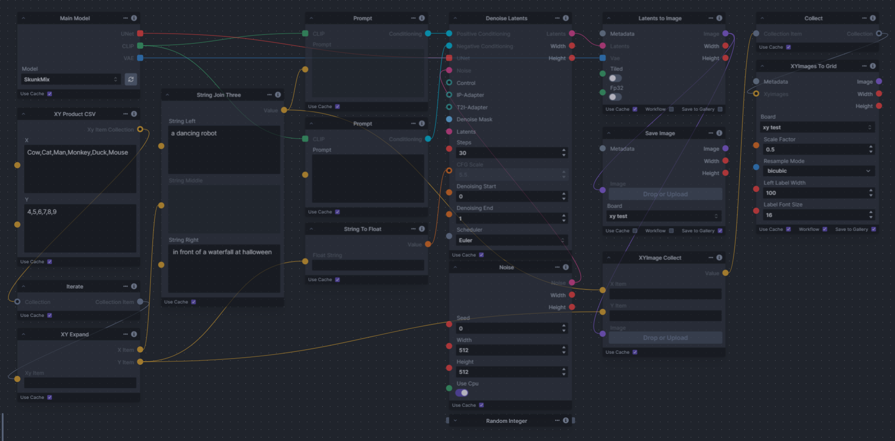
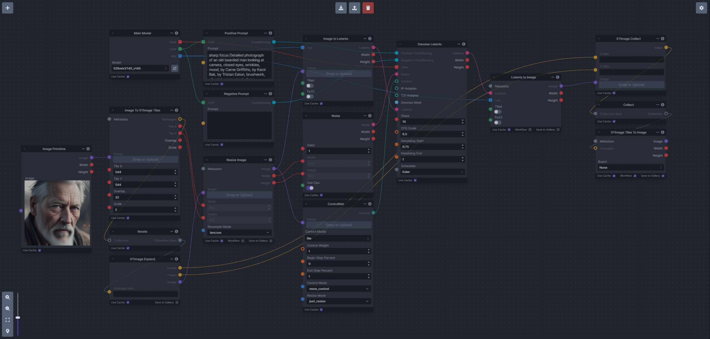
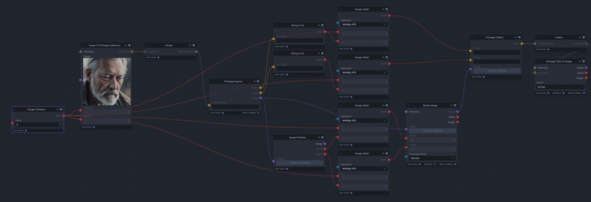

# XYGrid Nodes for InvokeAI (V3.4+ only)

Discord link :- [XYImage To Grid](https://discord.com/channels/1020123559063990373/1133465385182699582)

## Overview

These nodes add the following to InvokeAI:
- Generate grids of images from multiple input images
- Create XY grid images with labels from parameters
- Split images into overlapping tiles for processing (for super resolution workflows)
- Recombine image tiles into a single output image blending the seams 

The nodes include:
- [Images To Grids](#images-to-grids-node)  
- [XYImages To Grid](#xyimages-to-grids-node)
- [XYImage Tiles](#xyimage-tiles-nodes)
- [Image To XYImages](#image-to-xyimages-node)
- [Supporting nodes](#supporting-nodes)


## Usage

### Install

There are two options to install the nodes:

1. **Recommended**: Git clone the repo into the `invokeai/nodes` directory. This allows updating via `git pull`.

    - In the InvokeAI nodes folder, run:

        ```bash
        git clone https://github.com/skunkworxdark/XYGrid_nodes.git
        ```

2. Manually download [images_to_grids.py](images_to_grids.py) & [__init__.py](__init__.py) then place them in a subfolder under `invokeai/nodes`.  

**Important:** If you have a previous version of these nodes (pre Invoke 3.4) installed in `.env`, delete the old `images_to_grids.py` to avoid errors. Existing workflows may need updating due to node name and parameter changes. See included workflows for examples.

### Update

Run a `git pull` from the `XYGrid_nodes` folder.

Or run `update.bat` or `update.sh`.

For manual installs, download and replace the files.

### Remove

Delete the `XYGrid_nodes` folder. Or rename to `_XYGrid_nodes` so InvokeAI will ignore.


## Known issues
- `Images To Grids` output images don't automatically appear onscreen in the board.
  - Refresh the browser or force the board to load more images.
  - Or add iterate and show/save image nodes to the output of the `Images To Grids` node.
- Image generation will stop will stop with an invalid scheduler name.

## TODO
- Fix `Images To Grids` node output not automatically appear on screen in the board without workarounds
- Add other type to string and string to type conversions for other parameters e.g.  Model, Lora, images etc..
- Create a useable way to select multiple things from a list (some kind of checkbox selection) to enable selecting things from lists like models and loras etc
- A node that can calculate the ideal X and Y tile sizes based upon the input image ans scale value.

## Example workflows
Example workflows are in the [workflows](workflows) folder.

- [i2g_rndRange_wf.json](workflows/i2g_rndRange_wf.json) : Basic Images to Grids workflow using a Random Range
- [xygrid_csv-prompt-cfg_wf.json](workflows/xygrid_csv-prompt-cfg_wf.json) : XY Grid workflow example using Prompt joining and CFG Scale via CSV values
- [xygrid_csv-step-cfg_wf.json](workflows/xygrid_csv-step-cfg_wf.json) : XY Grid workflow example using Step and CFG Scale via CSV values
- [xygrid_csv-step-scheduler_wf.json](workflows/xygrid_csv-step-scheduler_wf.json) : XY Grid workflow example using Step and Scheduler CSV values
- [xygrid_range-step-cfg_wf.json](workflows/xygrid_range-step-cfg_wf.json) : XY Grid workflow example using Step and CFG Scale via Integer and Float ranges
- [xyimage_tile_wf.json](images/xyimage_tile_wf.json) : XYImage Tile scaling (Embiggen/Super Resolution) workflow
- [i2xyi_scale_wf.json](workflows/i2xyi_scale_wf.json) : Image To XYImage basic workflow


## Main Nodes  
### `Images To Grids` node
Creates image grids from a collection of input images. Multiple image grids created if more images than fit in one.
<details><summary>Details</summary>
<details><summary>Workflow Example</summary>

[i2g_rndRange_wf.json](workflows/i2g_rndrange_wf.json)

</details>

<details><summary>Output Example</summary>

Grid-1:

Grid-2:

</details>

<details><summary>Node</summary>


</details>

<details><summary>Inputs</summary>

- `Board`: Board to save images
- `Images`: Input images
- `Columns`: Images per row
- `Rows`: Rows per grid
- `Space`: Space between images
- `Scale Factor`: Resize amount
- `Resample Mode`: Resize method
- `Background Color`: Grid background color
</details>
</details>

### `XYImages To Grids` node
Converts `XYImage Item` collection into a labeled image grid.  The `XYImage Image` collection are built using the supporting nodes.
<details><summary>Details</summary>
<details><summary>Workflow Examples</summary>

[xygrid_csv-prompt-cfg_wf.json](workflows/xygrid_csv-prompt-cfg_wf.json)


[xygrid_csv-step-cfg_wf.json](workflows/xygrid_csv-step-cfg_wf.json)


[xygrid_csv-step-scheduler_wf.json](workflows/xygrid_csv-step-scheduler_wf.json)


[xygrid_range-step-cfg_wf.json](workflows/xygrid_range-step-cfg_wf.json)

</details>

<details><summary>Output Examples</summary>

xygrid_csv-prompt-cfg_example<br>

xygrid_csv-step-cfg_example<br>

xygrid_csv-step-scheduler_example<br>

xygrid_range-step-cfg_example<br>

</details>

<details><summary>Node</summary>

</details>

<details><summary>Inputs</summary>

- `Board`: Board to save
- `XYImages`: `XYImage Item` collection. Created by `XYImage Collect` node fed into a `Collect` node
- `Scale Factor`: Image resize amount
- `Resample Mode`: Resize method
- `Left Label Width`: Label column width
- `Label Font Size`: Label font size
</details>
</details>

### `XYImage Tiles` nodes

These nodes are designed to work together as a pair in a workflow. They allow you to split an image into tiles, process them, and then recombine them into an image. The nodes are:

- `Image To XYImage Tiles` : Cuts input image into overlapping tiles of a specified size and overlap.
- `XYImage Tiles To Image` : Merges tiles into a single image, blending the overlapping areas.

These nodes are not very intuitive to use, so I recommend checking out the example workflow and experimenting with it.

<details><summary>Details</summary>
<BR>
The advantage of these nodes is that they enable you to work with larger images than usual by dividing them into smaller tiles, applying transformations, and stitching them back together. The nodes can also create overlapping tiles to ensure consistency and smoothness between the tiles, and then blend them when reconstructing the image.
<BR><BR>

The best use case is to create a super-resolution effect, similar to Invoke's old Embiggen or Automatic1111's Super Resolution. This is done by a Tile controlnet to regenerate each tile at a higher resolution, and then recombining them into a much larger image. You can also try other image control methods, but the Tile controlnet seems to produce the most consistent results. You can also use no prompts at all and still get an OK image, but using the input image's original generation settings and prompts will give more consistent results.<BR>

### `Image To XYImage Tiles`
This takes an input image and cuts it up into smaller tiles.<BR>

For quick and easy results, you can use the following inputs:

- Tile X/Y: Generation sizes (512 for SD1.5, 1024 for SDXL
- Overlap: 32
- Scale: 2, 4, 8 (higher not recommended)

The way the input image is cut up is a bit complicated, but there is a logic behind it. Here is how it works:

- The Tile X, Tile Y, and Overlap values are scaled down by the Scale factor. These are used to cut up the input image.
- The first tile starts at the top-left corner of the image and has the size of the scaled down Tile X and Y values.
- The next tile starts (scaled down Overlap value) pixels before the end of the previous one on the X axis. This is repeated until there is not enough space for another tile.
- If the tiles don't divide perfectly into the source image then a final tile is created starting at the right edge of the image. This means that sometimes the last tile and row of tiles can have a large overlap unless you choose an ideal tile size.
- The same process is repeated on the Y axis of the image.
- All the tiles are packaged into an XYImage Item collection, with their X and Y parameters being their coordinates on the final enlarged image. 

Choosing an ideal tile size:
The overlap value is included in the tile size, so if you want to minimize the number of tiles needed, you need to account for that. As a rule of thumb choose the largest tile size that your GPU can generate that also is exactly divisible into the source image when scaled down and the overlap is taken into account. 
Examples:
- Scaling a 512 x 512 image by 2x with an Overlap of 32, use a tile size of 528 = 512 + 16 (half of the Overlap), this will give exactly 2 tiles across and 2 tiles down with a 32 pixel overlap in the middle.
- Scaling a 512 x 512 image by 4x with an Overlap of 32, use a tile size of 1040 = 1024 + 16 (half of the Overlap), this will give exactly 2 tiles across and 2 tiles down with a 32 pixel overlap in the middle. Because we are using the tile controlnet generations sizes above 512 will still give good results but experimentation is needed.
- Scaling a 1024 x 1024 image by 2x with an Overlap of 32, use a tile size of 1040 = 512 + 16 (half of the Overlap), this will give exactly 2 tiles across and 2 tiles down with a 32 pixel overlap in the middle.
- Scaling a 768 x 768 image by 2x with an Overlap of 32, use a tile size of 528 = 512 + 16 (half of the Overlap), this will give exactly 3 tiles across and 3 tiles down with a 32 pixel overlap in the middle.

### `XYImage Tiles To Image` 
This takes an `XYImage Tile Item` collection as output from `XYImage Collect` -> `Collect` nodes and recombines them blending the overlap areas and producing a single image. The result is a smooth and seamless image that preserves the details of each tile. It uses the X & Y parameters as coordinates to reconstruct the image.<BR>

<details><summary>Workflow Example</summary>

[xyimage_tile_wf.json](images/xyimage_tile_wf.json)

</details>

<details><summary>Output Example</summary>

Input:


2X Output:

</details>

<details><summary>Node</summary>

`Image To XYImage Tiles`


`XYImage Tiles To Image`


</details>

<details><summary>Inputs</summary>

`Image To XYImage Tiles`

- `Image` : Input image
- `Tile X` : Tile width that it will be regenerated at
- `Tile Y` : Tile height that it will be regenerated at
- `Overlap` : Tile overlap amount after regeneration
- `Scale` : Image scale factor

`XYImage Tiles To Image`
- `Board` : Board to save to
- `XY Images` : `XYImage Item` collection. This comes from feeding the X & Y outputs of the `XYImage Expand` node and the regenerated tile image into the `XYImage Collect` node and then into a `Collect` node.

</details>
</details>

### `Image To XYImages` node
This is probably not very useful node to most people. I created it for testing purposes while creating the Tile resize workflow. However I have included it because someone might find a use for it.<BR>

It takes an image and cuts it up into a number of columns and rows. Then outputs a `XYImage Item` collection.  The X & Y items contain the X & Y coordinates of where it was cut from the input image.<BR>

It is the less useful baby brother of the `Image To XYImage Tiles` node. It doesn't do overlapping regions or scaling. If you wish to scale the images then the X & Y value will also have to be scaled before they can be recombined. I put together an example simple scaling workflow that really isn't that useful but does demonstrate how it might be used.

<details><summary>Details</summary>
<details><summary>Workflow Examples</summary>

[i2xyi_scale_wf.json](workflows/i2xyi_scale_wf.json)
</details>

<details><summary>Output Example</summary>

</details>

<details><summary>Node</summary>

</details>

<details><summary>Input Descriptions</summary>

- `Image` : Input image
- `Columns` : Number of columns
- `Rows` : Number of rows
</details>
</details>


## Supporting Nodes
Helper nodes for data wrangling and building `XYImage` collections:

These nodes are used to create the `XY Item` and `XYImage Item` collections that drives the `XYImage To Grid` node.<BR>
The processing order is as follows `XY Data` -> `XY Product` or `XY Product CSV` -> `Iterate` -> `XY Expand` -> `Image Generation` -> `XY Image Collect` -> `Collect` -> `XYImages to Grid`

The best way to understand this is to look at the XYGrid workflow examples and play with them.

### XY Data Inputs and XY Product Nodes
These nodes provide ways of inputting and converting the X & Y data into a collection of strings that the `XY Product` node can use.
|Node|Description|
|-|-|
|`Floats To Strings`| Converts a Float or collections of Floats to a collection of strings.<BR> Intended use is take a float collection from a `Float Range` node that can be passed into the `XY Product` node.|
|`Ints To Strings`| Converts an Integer or collection of Integers to a collection of strings.<BR> Intended use is take an Integer collection from an `Integer Range` node that can be passed into the `XY Product` node.|
|`CSV To Strings`| Converts a CSV string to a collection of strings.<BR> Output of this is intended as input to the `XY Product` node. This basically does a does a splits the input string on every `,` character and ignores any other CSV conventions like quoted strings|
|`XY Product`| Takes individual X & Y string collections and outputs the product of these (a collection that has every combination of X and Y) as an `XY Item` collection.<BR> This is then passed into an `iterate` node and each `XY Item` is then passed one at a time into a `XY Expand` node.|
|`XY Product CSV`| This is two `CSV To Strings` nodes and an `XY Product` node combined into a single node for convenience. Taking X & Y CSV strings and outputting the product of these as a `XY Item` collection.<BR> This is then passed into an `iterate` node and each combination is then passed one at a time into a `XY Expand` node.|

<details><summary>Node Example images</summary>


</details>

### XY Expand, XYImage Expand , Data Output & XY Image Collect nodes
These nodes provide a way of extracting the X and Y data from `XY` & `XYImage` collections and converting the string back into types. Also collecting the resulting Image and XY data to pass onto the `XYImages To Grid` or `XYImage Tiles To Image` nodes. 

|Node|Description|
|-|-|
|`XY Expand`|Extracts X & Y strings from an `XY Item` output of the `XY Product` -> `iterate` node.<BR> The X & Y outputs can be passed to the X & Y inputs of the `XYImage Collect` node and used as the labels for the `XYImage To Grid` node.<BR> The X & Y outputs can be used directly into nodes inputs that accept strings e.g. Prompt, String Join etc.... However before been used as input to other nodes they will need to be converted into the correct type. This can be done with the `String To Float` and `String To Int` nodes|
|`XYImage Expand`|This is used as part of an `XY Image Tile` workflow. It extracts the X, Y & Image tile from an `XYImage Item` output of the `Image To XYImage Tile` -> `iterate` node.<BR>  The X & Y outputs **MUST** be passed to X & Y inputs of the `XYImage Collect` node as is to ensure the recombination works.<BR> The Image output is used with a `Tile` controlnet (or similar method) to generate a new up-scaled Image Tile. These are then also passed into the `XYImage Collect` node and then finally onto the `XYImage Tile To Image` node.|
|`String To Float`|Converts a string to a float. This is needed to convert the output of the `XY Expand` node before it can be used as input by nodes that accept the float data type e.g. CFG, Denoise start/end etc...|
|`String To Int`|Converts a string to an integer. This is needed to convert the output of the `XY Expand` node before it can be used as input by nodes that accept the integer data type e.g. Step, Width, Height etc....|
|`String To Scheduler`|Converts a string to a scheduler. This is needed to convert the output of the `XY Expand` node before it can be used as input by nodes that accept the scheduler data type.  Scheduler has to be provided as a string via a `CSV` and `string` based node in the internal name format.<BR> At the time of writing this can only be from the following values (ddim, ddpm, deis, lms, lms_k, pndm, heun, heun_k, euler, euler_k, euler_a, kdpm_2, kdpm_2_a, dpmpp_2s, dpmpp_2s_k, dpmpp_2m, dpmpp_2m_k, dpmpp_2m_sde, dpmpp_2m_sde_k, dpmpp_sde, dpmpp_sde_k, unipc) if in the future these are added to then the list can be found in the core schedulers.py file|
|`XYImage Collect`|The job of this node is to collect the generated Images and the X & Y items in a single place so they can be passed onto the `Collect` node then onto the `XYImage To Grid` or `XYImage Tile To Image` nodes.|

<details><summary>Node Example images</summary>


</details>

