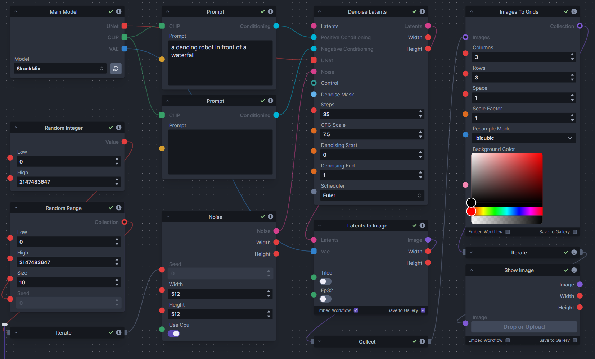
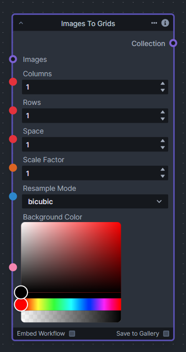
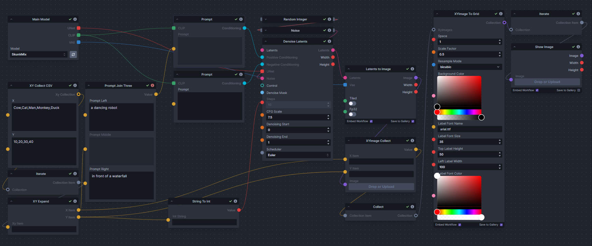
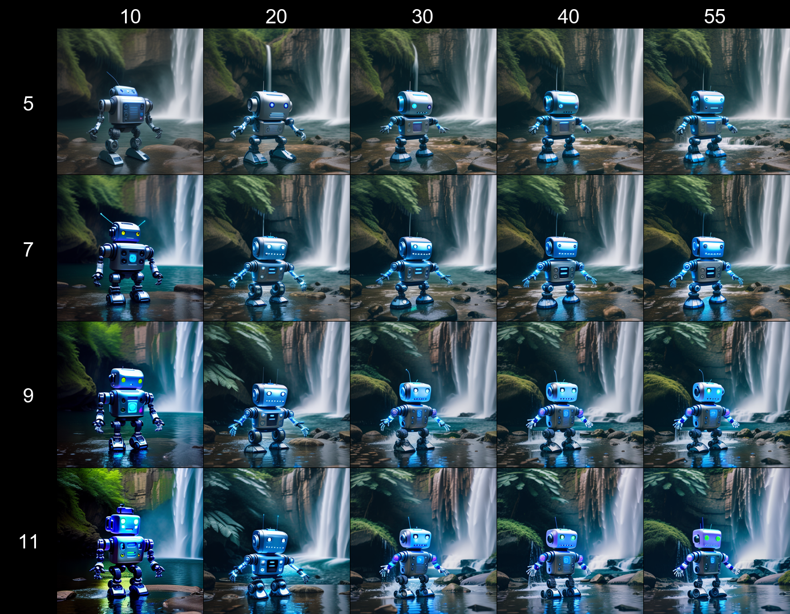
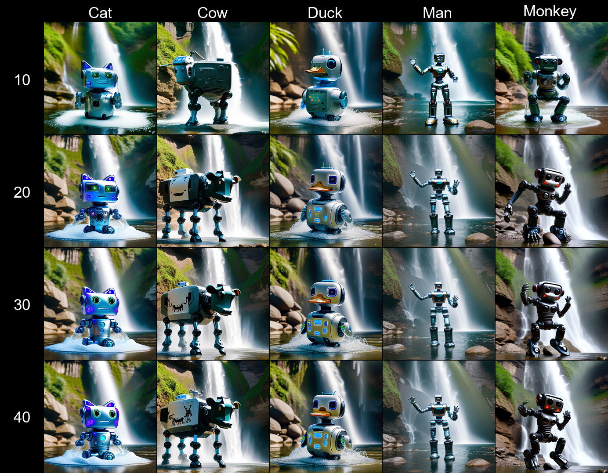

# images_to_grids.py Nodes
InvokeAI nodes for `Images To Grids`, `XYImage To Grid` and supporting nodes

## Usage
If you want to use these nodes then you need to place the [images_to_grids.py](ImagesToGrid-rndRange.py) file in the folder `".venv\Lib\site-packages\invokeai\app\invocations"`. 

## Discord Link
The discord link for discussion is :- [XYImage To Grid](https://discord.com/channels/1020123559063990373/1133465385182699582) .

### Example workflows
|Workflow|Description|
|-|-|
|[ImagesToGrid-rndRange.json](ImagesToGrid-rndRange.json)| Basic Images to Grid workflow using a Random Range|
|[csv-cfg-prompt-xygrid.json](csv-cfg-prompt-xygrid.json)| XY Grid workflow example using Prompt and CFG Scale via CSV values|
|[csv-cfg-step-xygrid.json](csv-cfg-step-xygrid.json)| XY Grid workflow example using Step and CFG Scale via CSV values|
|[range-cfg-step-xygrid.json](range-cfg-step-xygrid.json)| XY Grid workflow example using Step and CFG Scale via Integer and Float ranges|

### Known issues
- When the Grids are added to the gallery it will not automatically update onscreen.
  - Either Refresh the browser.
  - Or add an iterate node and a show image node off the grid node.
- Unable to embed workflow into grid images
  - No workaround as yet you will have to embed is each of the individually generated images
- The generation will crash and stop if an invalid scheduler is passed in

### TODO
- Grid still doesn't appear in the board without workarounds
- Other type to string and string to type conversions for other parameters like  Model, Lora, images etc..
- a useable way to select multiple things from a list (some kind of checkbox selection) to enable selecting things from lists like models and loras etc

## Main Nodes  
### `Images To Grids` node
Takes a collection of images and creates a grid(s) of images. If there are more images than the size of a single grid then multiple grids will be created until it runs out of images.

Workflow Example

Output Example

Node

Input Descriptions

|Input|Description|
|-|-|
|`Images`| This is the collection of images to add to the grids. It is used by collecting the images with a `Collect` node and feeding this into this input|
|`Columns`| The number of images across in the grids|
|`Rows`| The maximum rows per grid|
|`Space`| The number of pixels gap between images|
|`Scale Factor`| How much to resize the images by (values of 0...1 will reduce the image size, This is recommended if you have large images or large grids)|
|`Resample Mode`| Resize type to use|
|`Background Color`| Background color of the grid|

### `XYImage To Grid` node
Converts a collection of `XYImages` into a labeled Grid of images.  The `XYImages` collection has to be built using the XY Grid supporting nodes. See example node setups for more details.

Workflow Examples

Output Example

Node

Input Descriptions

|Input|Description|
|-|-|
|`XY Images`|This is the collection of images and XY items to add to the grid. It is used by `XYImage Collect` node and a `Collect` node and feeding this into this input|
|`Space`|The number of pixels gap between images|
|`Scale Factor`|How much to resize the images by (values of 0...1 will reduce the image size, This is recommended if you have large images or large grids)|
|`Resample Mode`|Resize type to use|
|`Background Color`| background color of the grid|
|`Label Font Name`| Font to use for the labels Default "Ariel.ttf"|
|`Label Front Size`| Size of the font to use for labels Default 35|
|`Top Label Height`| Vertical size to the labels space at the top of the grid.|
|`Left Label Width`| Horizontal Size of the labels space at the left of the grid.|
|`Label Font Color`| Font color of the label|

## XYGrid Supporting Nodes
These nodes are used to create the `XY Images` collection that drives the `XYImage To Grid` Node.   The workflow is as follows `XY Data Inputs` and/or `XY Collect` -> `Iterate` -> `XY Expand` -> `XY Image Collect` -> `Collect` -> `XYImages to Grid`

The best way to understand this is to look at the XYGrid workflow examples and play with them.

### XY Data Inputs and Collect Nodes
These Nodes provide a way of inputting or converting the X and Y data into a collection of strings that the `XY Collect` Node can use.
|Node|Description|
|-|-|
|`Floats To Strings`|Takes a float or collections of floats and converts it to a collection of string.  Intended use is take a float collection from a `Float Range` node that can be passed into the `XY Collect` node.|
|`Ints To Strings`|Takes an int or collection of ints and converts it to a collection of string. Output of this is intended for the `XY Collect` node.  Intended use is take a float collection from an `Integer Range` node that can be passed into the `XY Collect` node.|
|`CSV To Strings`|Takes a CSV string and converts it to a collection of strings.  Output of this is intended as input to the `XY Collect` node. |
|`XY Collect`|Takes X and Y string collections and outputs a collection that has every combination of X and Y as an `XY Collection`.  This is then passed into an `iterate` node and each combination is then passed one at a time into the `XY Expand` node.|
|`XY Collect CSV`|This is `CSV To Strings` and `XY Collect` in a single node. Taking X and Y CSV strings and outputting a collection that has every combination of X and Y as an `XY Collection`.  This is then passed into an `iterate` node and each combination is then passed one at a time into the `XY Expand` node.|

Node Examples

### XY Expand , Data Output & XY Image Collect nodes
|Node|Description|
|-|-|
|`XY Expand`|This takes the `XY Collection` output of the iterate node and expands it to individual X and Y items as strings.   The output of this needs to be passed into the `XYImage Collect` Node as is. It can also be used directly into nodes that accept strings e.g. Prompt.  However before been used as input to other nodes they will need to be converted into the correct type. This can be done with the `String To Float` and `String To Int` Nodes|
|`String To Float`|Converts a string to a float. This is needed to convert the output of the `XY Expand` node before it can be used as input by nodes that accept the float data type e.g. CFG, Denoise start/end etc...|
|`String To Int`|Converts a string to an integer. This is needed to convert the output of the `XY Expand` node before it can be used as input by nodes that accept the integer data type e.g. Step, Width, Height etc....|
|`String To Scheduler`|Converts a string to a scheduler. This is needed to convert the output of the `XY Expand` node before it can be used as input by nodes that accept the scheduler data type.  Scheduler has to be provided as a string via a `CSV` and `string` based node in the internal name format. At thw time of writing this can only be from the following values (ddim,ddpm,deis,lms,lms_k,pndm,heun,heun_k,euler,euler_k,euler_a,kdpm_2,kdpm_2_a,dpmpp_2s,dpmpp_2s_k,dpmpp_2m,dpmpp_2m_k,dpmpp_2m_sde,dpmpp_2m_sde_k,dpmpp_sde,dpmpp_sde_k,unipc) if in the future these are added to then the list can be found in the core schedulers.py file|
|`XYImage Collect`|The job of this node is to collect the generated Images and the X and Y items in a single place so they can be passed onto the `Collect` node then onto the `XYImage To Grid` node.|

Node Examples

