# XYGrid Nodes (*InvokeAI 3.4+ only*)
InvokeAI nodes for [Images To Grids](#images-to-grids-node), [XYImages To Grid](#xyimages-to-grids-node), [XYImage Tiles](#xyimage-tiles-nodes), [Image To XYImages](#image-to-xyimages-node) and [supporting nodes](#supporting-nodes). 
The discord link for discussion is :- [XYImage To Grid](https://discord.com/channels/1020123559063990373/1133465385182699582) .  
### TL;DR
These nodes can do the following things. 
1. Produce Grids of images from multiple images. [`Images To Grids`](#images-to-grids-node)
2. Generate multiple images from parameters and output an XY Grid with Labels. [`XYImages To Grid`](#xyimages-to-grids-node)
3. Split up an image into overlapping tiles so that they can be used to generate a larger version then join the images back together blending the seams between the images. This is a bit like Invoke's old Embiggen or Automatic1111's Super Resolution. [`XYImages To Grid`](#xyimages-to-grids-node) & [`Image To XYImages`](#image-to-xyimages-node) & [`Image To XYImage Tiles`](#image-to-xyimage-tiles-node)
4. Other nodes for collection and manipulation of the XY data and converting to and from strings. [`supporting nodes`](#supporting-nodes)

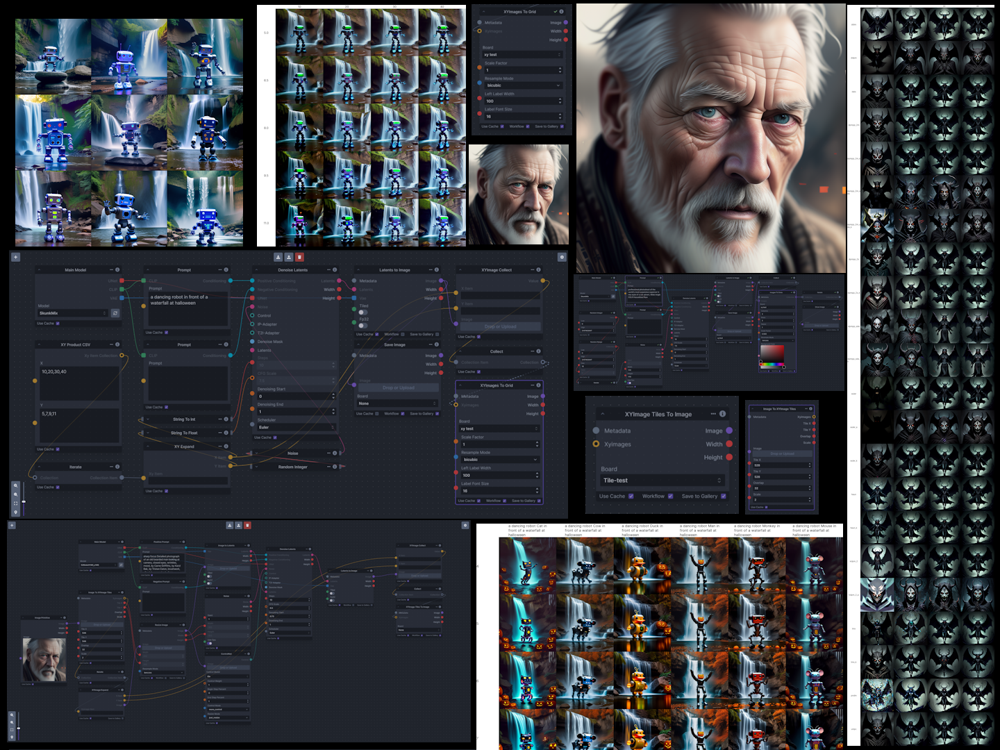
## Usage
<ins>Install:</ins> 
Their are two options for installing these nodes. (Option 1 is the recomended option) 
1. Git clone the repo into the `invokeai/nodes` directory. (**Recommended** - as it allows updating via a git pull)
    - open a command prompt/terminal in the invokeAI nodes directory ( or choose `8. Open the developer console` option from the invoke.bat then `cd nodes`)
    - run `git clone https://github.com/skunkworxdark/XYGrid_nodes.git`
2. Manually download and place [images_to_grids.py](images_to_grids.py) in a sub folder in the `invokeai/nodes` folder.

Important Note: If you have used a previous version of these nodes (Pre Invoke 3.4) that where installed in the .env invocations directory. Then the existing images_to_grids.py file must be deleted from the invocations directory otherwise invoke will throw an error with duplicate nodes. Also note that some of these nodes have changed names and parameters so existing workflows will need to be remade. See included workflows for examples.

<ins>Update:</ins> 
Run a `git pull` from the `XYGrid_nodes` folder. Or run the `update.bat` or `update.sh` that is in the `invokeai/nodes/XYGrid_nodes` folder. If you installed manually then the only option is monitor the repo or discord channel and manually download and replace the file yourself.

<ins>Remove:</ins> 
Simply delete the `XYGrid_nodes` folder or you can rename it by adding and underscore `_XYGrid_nodes` and Invoke will ignore it.

## Known issues
- When the `Images To Grids` nodes adds its output images to a board the board will not automatically update onscreen.
  - Either Refresh the browser.
  - Or force the board to load more items.
  - Or add an iterate node and a show or save image node off images collection output of the Images To Grid node.
- The generation will stop if an invalid scheduler name is passed in.

## TODO
- `Images To Grids` nodes output images still doesn't appear in the board without workarounds
- Add other type to string and string to type conversions for other parameters e.g.  Model, Lora, images etc..
- A useable way to select multiple things from a list (some kind of checkbox selection) to enable selecting things from lists like models and loras etc
- A node that can calculate the ideal X and Y tile sizes based upon the input image ans scale value.

## Example workflows
The example workflows can be found in the [workflows](workflows) folder.
|Workflow|Description|
|-|-|
|[i2g_rndRange_wf.json](workflows/i2g_rndRange_wf.json)| Basic Images to Grids workflow using a Random Range|
|[xygrid_csv-prompt-cfg_wf.json](workflows/xygrid_csv-prompt-cfg_wf.json)| XY Grid workflow example using Prompt joining and CFG Scale via CSV values|
|[xygrid_csv-step-cfg_wf.json](workflows/xygrid_csv-step-cfg_wf.json)| XY Grid workflow example using Step and CFG Scale via CSV values|
|[xygrid_csv-step-scheduler_wf.json](workflows/xygrid_csv-step-scheduler_wf.json)| XY Grid workflow example using Step and Scheduler CSV values|
|[xygrid_range-step-cfg_wf.json](workflows/xygrid_range-step-cfg_wf.json)| XY Grid workflow example using Step and CFG Scale via Integer and Float ranges|
|[xyimage_tile_wf.json](images\xyimage_tile_wf.json)|XYImage Tile scaling (Embiggen/Super Resolution) workflow.|
|[i2xyi_scale_wf.json](workflows\i2xyi_scale_wf.json)|Image To XYImage basic workflow|

## Main Nodes  
### `Images To Grids` node
Takes a collection of images and creates a grid(s) of images. If there are more images than the size of a single grid then multiple grids will be created until it runs out of images.

Details

Workflow Example

[i2g_rndRange_wf.json](workflows/i2g_rndrange_wf.json)
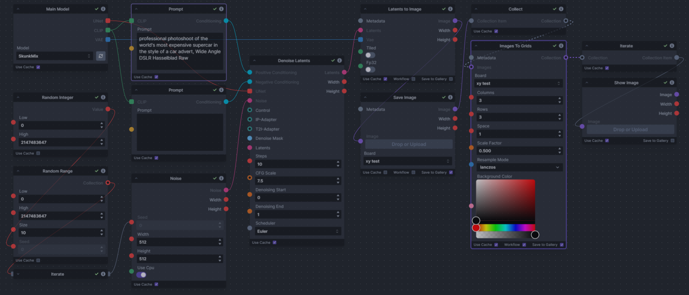

Output Example

Grid-1:

Grid-2:
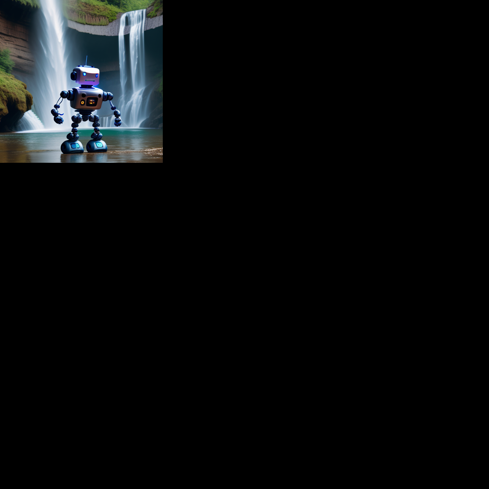

Node

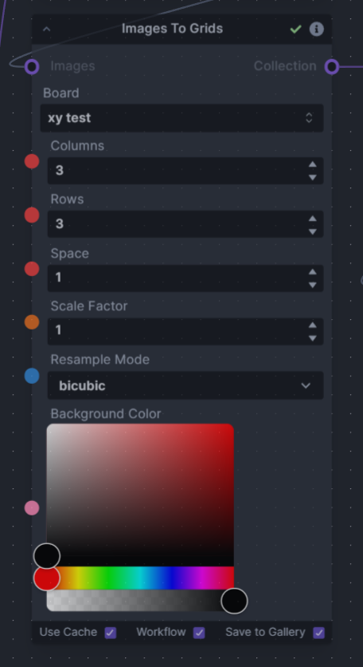

Input Descriptions

|Input|Description|
|-|-|
|`Board`| The board you want the image saved into.|
|`Images`| This is the collection of images to add to the grids. It is used by collecting the images with a `Collect` node and feeding this into this input|
|`Columns`| The number of images across in the grids|
|`Rows`| The maximum rows per grid|
|`Space`| The space to be added between images|
|`Scale Factor`| How much to resize the images by (values of 0...1 will reduce the image size, This is recommended if you have large images or large grids)|
|`Resample Mode`| Resize type to use|
|`Background Color`| Background color of the grid|

### `XYImages To Grids` node
Converts a collection of `XYImages` into a labeled Grid of images.  The `XYImages` collection has to be built using the XY Grid supporting nodes. See workflow examples for more details.

Details

Workflow Examples

[xygrid_csv-prompt-cfg_wf.json](workflows/xygrid_csv-prompt-cfg_wf.json)

[xygrid_csv-step-cfg_wf.json](workflows/xygrid_csv-step-cfg_wf.json)
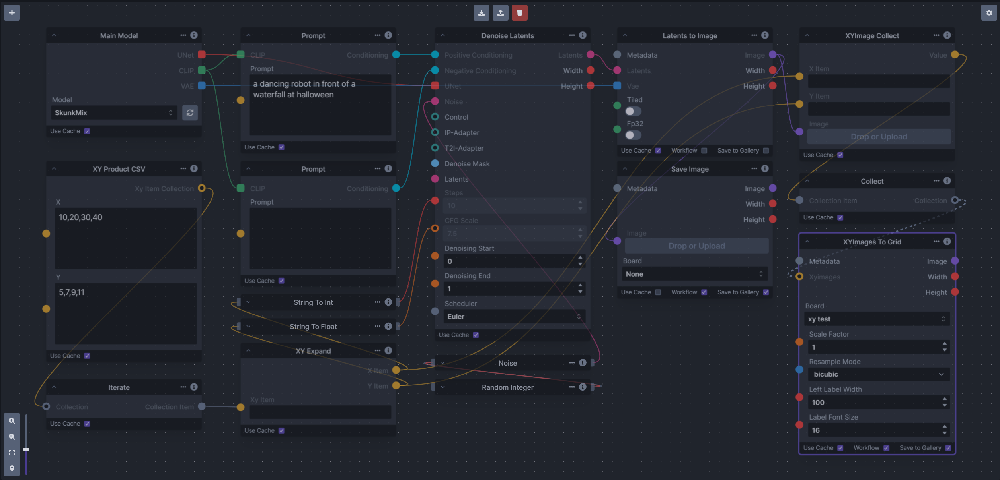

[xygrid_csv-step-scheduler_wf.json](workflows/xygrid_csv-step-scheduler_wf.json)
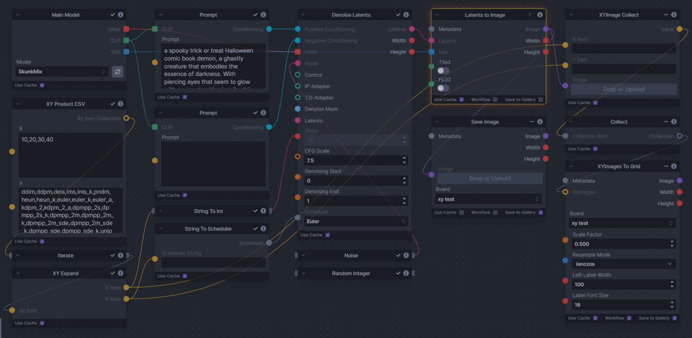

[xygrid_range-step-cfg_wf.json](workflows/xygrid_range-step-cfg_wf.json)
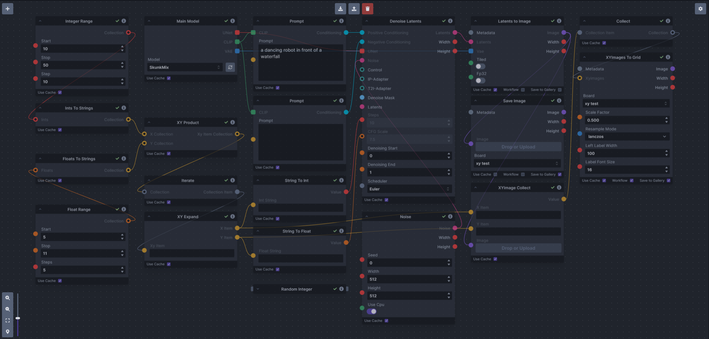

Output Examples

xygrid_csv-prompt-cfg_example 

xygrid_csv-step-cfg_example 

xygrid_csv-step-scheduler_example 

xygrid_range-step-cfg_example 
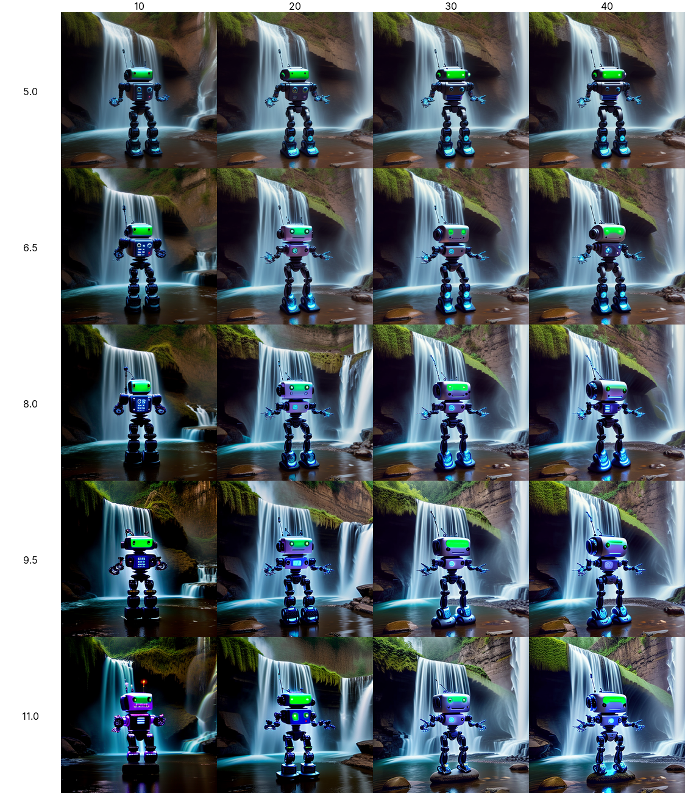

Node

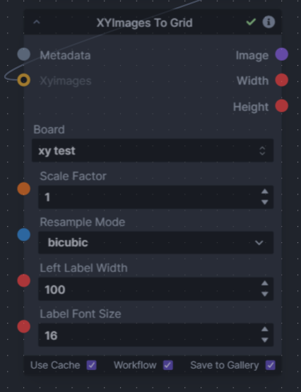

Input Descriptions

|Input|Description|
|-|-|
|`Board`| The board you want the image saved into.|
|`XYImages`|This is the collection of XYImage items to add to the grid. It is used by `XYImage Collect` node and a `Collect` node and feeding this into this input|
|`Scale Factor`|How much to resize the images by (values of 0...1 will reduce the image size, This is recommended if you have large images or large grids)|
|`Resample Mode`|Image resize mode to use|
|`Left Label Width`| Width of the labels space at the left of the grid|
|`Label Front Size`| Size of the font to use for labels|

### `XYImage Tiles` nodes
These consists of two separate nodes, `Image To XYImage Tiles` and `XYImage Tiles To Image`, that need to be considered together as they will generally be used as a pair in a workflow. `Image To XYImage Tiles` cuts an input image into tiles and `XYImage Tiles To Image` combines them back together into new image after they have been processed. 

The use of these nodes is not that straight forward so I would recommend starting by looking at the example workflow and experimenting with it. 

Details

 
The power of these nodes is you can operate on larger images than you normally could by splitting up an images into smaller tiles, processing them and combining them back into a larger image. It has the ability to make the tiles overlapping so there can be some consistency between tiles and then blend these overlapping areas when the image is reconstructed.
  

The example workflow and best use case I have so far is a bit like Invoke's old Embiggen or Automatic1111's Super Resolution. This is achieved by feeding the tiles into the Tile controlnet to regenerate each tile at a higher resolution. Then recombine them back into a much larger image. I would imagine that other image control methods could be used with interesting results but my testing has shown the Tile controlnet gives the most consistent output.  Additionally you can use no prompts at all and still get a reasonable image but matching the the input images original generation settings will probably give the best results. 

`Image To XYImage Tiles` - This takes an input image and cuts it up into smaller tiles. 

For quick and easy results the inputs Tile X and Tile Y is the size that the tile will be reprocessed to, for SD1.5 this could just be kept at 512 and SDXL 1024 as that is the idea generation size. The overlap works well at 32 and the Scale should probably be 2,4 or 8. 

The way the input image is cut up is not straight forward but there are reasons to the madness (well at least in my head). How it works internally is the Tile X, Tile Y and overlap are scaled down and this is what is used to cut up the image. The fist tile starts at 0,0 and is the size of the scaled down Tile X and Y sizes. The next tile starts (scaled down overlap size) pixels back from the end of the previous one. This is continued until the remaining area is smaller than the tile size.  Then a final tile is taken starting at the right of the images and overlaps by however much it needs to.  The same process happens on the Y axis of the image cutting.  All the images are then packaged into the XYImage Item collection. with the X and Y parameters been the scaled up coordinates of the final image. This does mean that quite often the final tile will have a fairly large overlap unless care is taken to choose an ideal tile size.  

Note: The overlap is part of the tile size so if you want to make an ideal tile size and minimize the number of tiles used this needs to be taken into account. e.g.  If you are scaling a 512 x 512 image and you have an overlap of 32 then you should use a tile size of 528 = 512 + 16 (half the overlap).  This size will give exactly two tiles across and two tiles up with a 32 pixel overlap in the middle.  

`XYImage Tiles To Image` - This takes an `XYImage Item` collection as output from `XYImage Collect` -> `Collect` nodes and recombines them blending the overlap areas and producing a single image. 

Workflow Example

[xyimage_tile_wf.json](images\xyimage_tile_wf.json)

Output Example

input image:
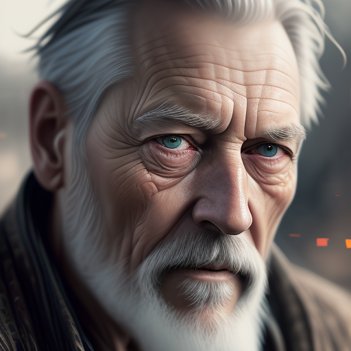

2X output image:
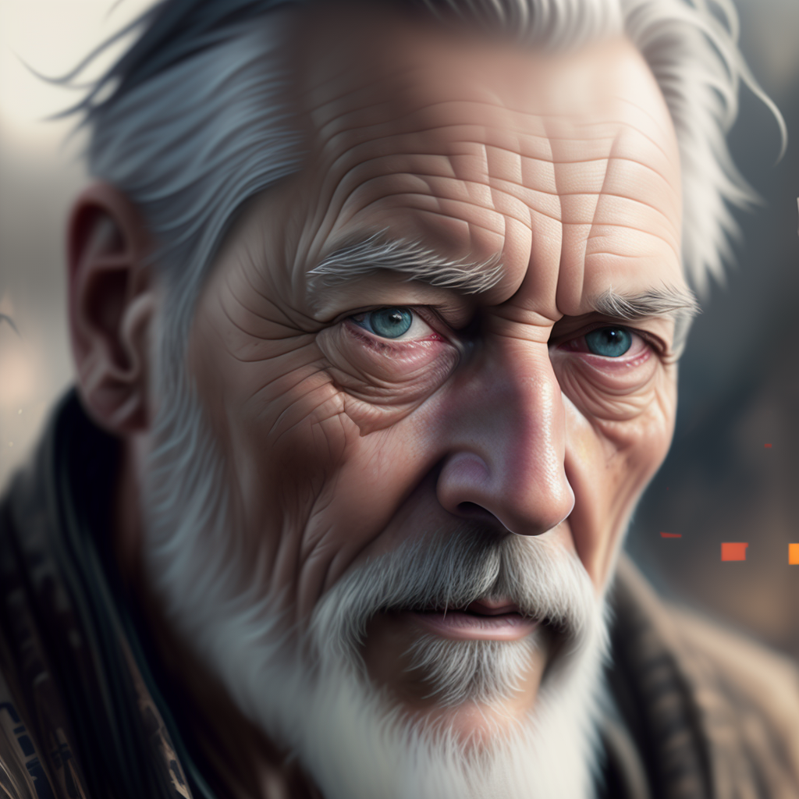

Node

`Image To XYImage Tiles`

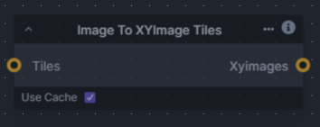

`XYImage Tiles To Image`

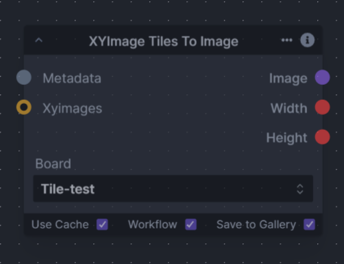

Input Descriptions

`Image To XYImage Tiles`
|Input|Description|
|-|-|
|`Image`|The input image|
|`Tile X`|The width that the tile will be regenerated at|
|`Tile Y`|The height that the tile will be regenerated at|
|`Overlap`|The size of the tile overlap after regeneration|
|`Scale`|How much the image will be resized|

`XYImage Tiles To Image`
|Input|Description|
|-|-|
|`Board`| The board you want the image saved into.|
|`XY Images`|This is the collection of images and XY items to build the output from. This comes from feeding the X & Y outputs of the `XYImage Expand` node and the regenerated image into the `XYImage Collect` node and then into a `Collect` node before feeding into this input|

### `Image To XYImages` node
This is probably not very useful node to most people. I created it for testing purposes while creating the Tile resize workflow. However I have included it because someone might find a use for it. 

I basically takes an image and cuts it up into a number of columns and rows. Then outputs a `XYImage Item` collection.  The X & Y items contain the X & Y coordinates of where it was cut from the input image. 

It is the less useful baby brother of the `Image To XYImage Tiles` node. Except it doesn't do overlapping regions. I put together an example simple scaling workflow that really isn't that useful but does demonstrate how it might be used.

Details

Workflow Examples

[i2xyi_scale_wf.json](workflows\i2xyi_scale_wf.json)

Output Example

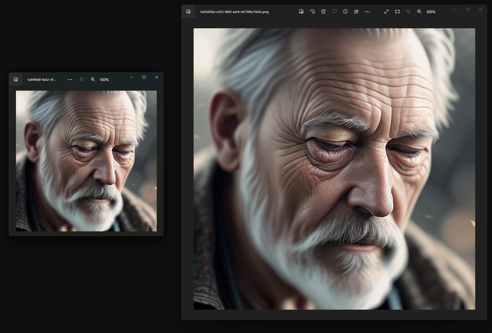

Node

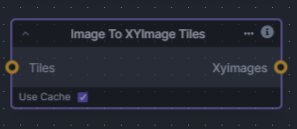

Input Descriptions

|Input|Description|
|-|-|
|`Image`|The input image|
|`Columns`|The number of columns to cut the image into|
|`Rows`|The number of Rows to cut the image into|

## Supporting Nodes
These nodes are used to create the `XY Item` and `XYImage Item` collections that drives the `XYImage To Grid` node.   The processing order is as follows `XY Data` -> `XY Product` or `XY Product CSV` -> `Iterate` -> `XY Expand` -> `Image Generation` -> `XY Image Collect` -> `Collect` -> `XYImages to Grid`

The best way to understand this is to look at the XYGrid workflow examples and play with them.

### XY Data Inputs and XY Product Nodes
These nodes provide a way of inputting or converting the X and Y data into a collection of strings that the `XY Collect` node can use. Also collecting the resulting Image and XY data to pass onto the `XYImages To` nodes. 
|Node|Description|
|-|-|
|`Floats To Strings`| Converts a Float or collections of Floats to a collection of strings.  Intended use is take a float collection from a `Float Range` node that can be passed into the `XY Collect` node.|
|`Ints To Strings`| Converts an Integer or collection of Integers to a collection of strings.  Intended use is take an Integer collection from an `Integer Range` node that can be passed into the `XY Collect` node.|
|`CSV To Strings`| Converts a CSV string to a collection of strings.  Output of this is intended as input to the `XY Collect` node. This basically does a does a splits the input string on every `,` character and ignores any other CSV conventions like quoted strings|
|`XY Product`| Takes X & Y string collections and outputs the product of these (a collection that has every combination of X and Y) as an `XY Item Collection`.  This is then passed into an `iterate` node and each `XY Item` is then passed one at a time into the `XY Expand` node.|
|`XY Product CSV`| This is two `CSV To Strings` nodes and an `XY Product` node combined into a single node for convenience. Taking X & Y CSV strings and outputting the product of these as `XY Item Collection`.  This is then passed into an `iterate` node and each combination is then passed one at a time into the `XY Expand` node.|

Node Example images

Note: `XY Collect` is now `XY Product`
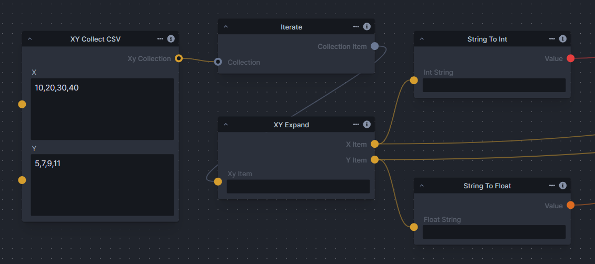
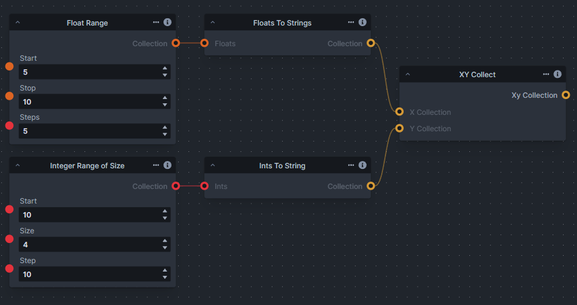
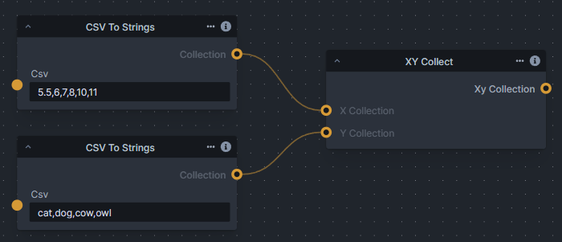

### XY Expand, XYImage Expand , Data Output & XY Image Collect nodes
These nodes provide a way of inputting or converting the X and Y data into a collection of strings that the `XY Collect` node can use. Also collecting the resulting Image and XY data to pass onto the `XYImages To Grid` or `XYImage Tiles To Image` nodes. 

|Node|Description|
|-|-|
|`XY Expand`|Extracts X & Y strings from an `XY Item` output of the `XY Product` -> `iterate` node.  The X & Y outputs can be passed to the X & Y inputs of the `XYImage Collect` node and used as the labels for the `XYImage To Grid` node.  The X & Y outputs can be used directly into nodes inputs that accept strings e.g. Prompt, String Join etc.... However before been used as input to other nodes they will need to be converted into the correct type. This can be done with the `String To Float` and `String To Int` nodes|
|`XYImage Expand`|This is used as part of an `XY Image Tile` workflow. It extracts the X, Y and ImageTile from an `XYImage Item` output of the `Image To XYImage Tile` -> `iterate` node.   The X & Y outputs **MUST** be passed to X& Y inputs of the `XYImage Collect` node as is to ensure the recombination works.  The Image output is used with a `Tile` controlnet (or similar method) to generate a new up-scaled Image Tile. These are then also passed into the `XYImage Collect` node and then finally onto the `XYImage Tile To Image` node.|
|`String To Float`|Converts a string to a float. This is needed to convert the output of the `XY Expand` node before it can be used as input by nodes that accept the float data type e.g. CFG, Denoise start/end etc...|
|`String To Int`|Converts a string to an integer. This is needed to convert the output of the `XY Expand` node before it can be used as input by nodes that accept the integer data type e.g. Step, Width, Height etc....|
|`String To Scheduler`|Converts a string to a scheduler. This is needed to convert the output of the `XY Expand` node before it can be used as input by nodes that accept the scheduler data type.  Scheduler has to be provided as a string via a `CSV` and `string` based node in the internal name format.  At the time of writing this can only be from the following values (ddim, ddpm, deis, lms, lms_k, pndm, heun, heun_k, euler, euler_k, euler_a, kdpm_2, kdpm_2_a, dpmpp_2s, dpmpp_2s_k, dpmpp_2m, dpmpp_2m_k, dpmpp_2m_sde, dpmpp_2m_sde_k, dpmpp_sde, dpmpp_sde_k, unipc) if in the future these are added to then the list can be found in the core schedulers.py file|
|`XYImage Collect`|The job of this node is to collect the generated Images and the X & Y items in a single place so they can be passed onto the `Collect` node then onto the `XYImage To Grid` or `XYImage Tile To Image` nodes.|

Node Example images

Note: `XY Collect` is now `XY Product`
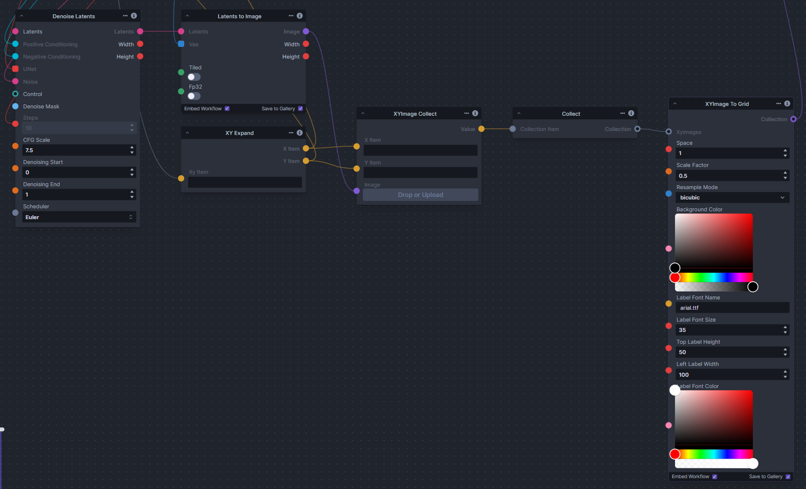
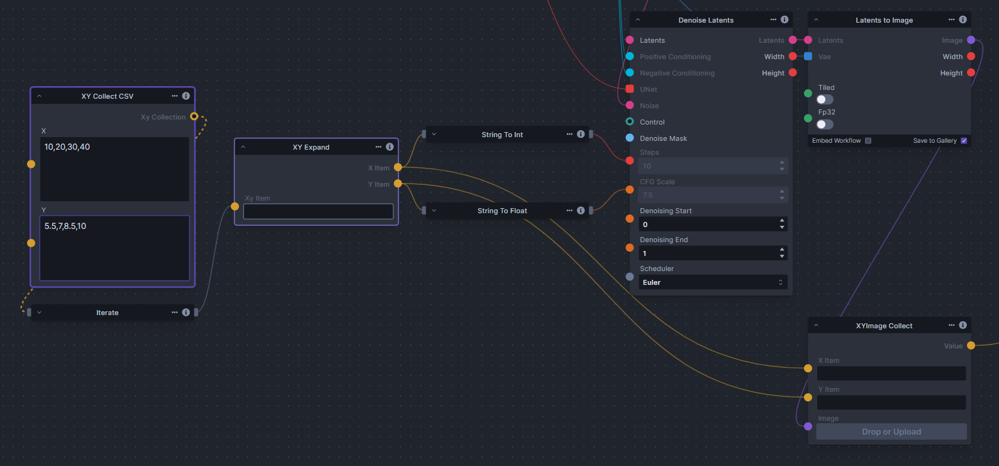
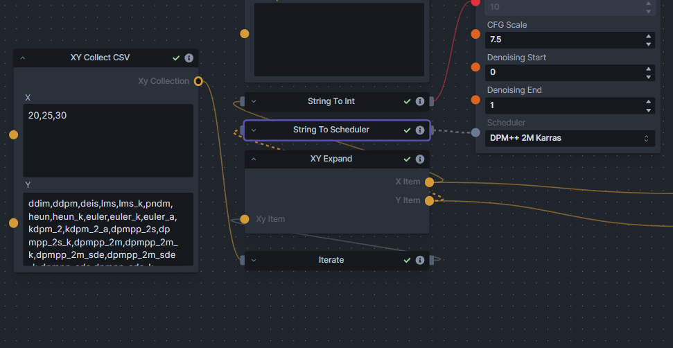

